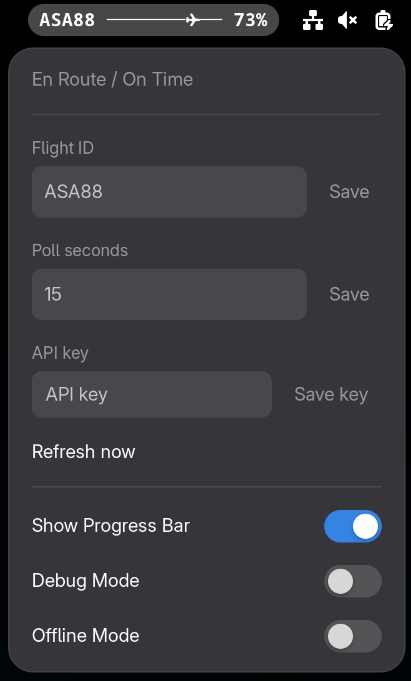

# flyshell

GNOME Shell extension that tracks in-progress flights in the top bar using [FlightAware AeroAPI](https://www.flightaware.com/aeroapi/).

Supports GNOME Shell 45–48.




## Features

- Live flight tracking via FlightAware AeroAPI (`GET /flights/{ident}`).
- Defensive filtering picks the active en-route flight automatically.
- Two display modes — **percentage** (`UAL1234 42%`) or **progress bar** (`UAL1234 ─────✈─── 45%`).
- **Offline mode** — fetch timestamps once, then compute progress locally with no further API calls.
- **Debug mode** — iterate through bundled mock snapshots without needing an API key.
- Click-menu for all configuration: flight ID, poll rate, API key, display mode, offline/debug toggles.
- Preferences window (GNOME Extensions app) with the same settings.

## Display modes

Toggle between modes via the menu switch or the preferences window.

| Mode | Top-bar output |
|------|---------------|
| Percentage (default) | `UAL1234 42%` |
| Progress bar | `UAL1234 ─────✈─── 45%` |

When a flight reaches 100 %, the indicator shows `UAL1234 ✅`.

## Offline mode

Offline mode makes a **single** API call to fetch departure and arrival timestamps,
then calculates progress locally based on the current time — no further network
requests are made.

1. Enable **Offline Mode** in the menu or preferences.
2. The extension fetches the configured flight ID once and caches departure/arrival times.
3. Subsequent polls compute `elapsed / total_duration × 100` locally.
4. Disabling offline mode clears the cache and resumes normal API polling.

This is useful if you want to minimise API usage or monitor a flight with
limited connectivity.

## Debug mode

Debug mode replaces live data with a bundled mock flight (`mock_flight.json`)
that cycles through 11 snapshots (0 %–100 %) at a 1-second poll interval.

1. Enable **Debug Mode** in the menu or preferences.
2. The indicator will show `MOCK001` advancing through each snapshot.
3. A **Replay Mock Flight** button appears in the menu to restart the sequence.

No API key or network access is required — useful for development and testing.

## Settings

All settings are accessible from the panel menu and the GNOME Extensions
preferences window.

| Setting | Default | Range | Description |
|---------|---------|-------|-------------|
| Flight ID | *(empty)* | — | Flight identifier, e.g. `UAL1234` (auto-uppercased) |
| Poll interval | 60 s | 15–3600 s | How often to refresh (overridden to 1 s in debug mode) |
| Display mode | percentage | percentage / progress-bar | Top-bar format |
| Debug mode | off | — | Use bundled mock data instead of live API |
| Offline mode | off | — | Fetch once, compute progress locally |

## Security and stability notes

- API key is stored in the system keyring via `secret-tool`, never in plain text settings.
- Network calls are performed by a Python helper subprocess (`scripts/fetch_flight.py`).
- The extension calls the subprocess asynchronously and never blocks the Shell main loop.

## Dependencies

- `python3`
- `secret-tool` (usually from the `libsecret` package)

## First-time setup

1. Click the flyshell indicator in the top bar.
2. Enter and save your FlightAware AeroAPI key.
3. Enter and save a flight identifier (e.g. `UAL1234`).
4. Optionally adjust the polling rate and display mode.

## Local install (development)

Preferred:

```bash
./scripts/install-local.sh
```

Manual fallback:

```bash
mkdir -p ~/.local/share/gnome-shell/extensions/flyshell@flyshell
rsync -a --exclude='.git/' --exclude='.gitignore' --exclude='README.md' --exclude='__pycache__/' \
  ./ ~/.local/share/gnome-shell/extensions/flyshell@flyshell/
glib-compile-schemas ~/.local/share/gnome-shell/extensions/flyshell@flyshell/schemas
gnome-extensions enable flyshell@flyshell
```

Restart GNOME Shell (or log out/in on Wayland) after the first install.

## No-logout development loop

For most JS/CSS/schema edits you do not need to log out.

```bash
./scripts/install-local.sh
```

The installer does an in-place reload (disable + enable) and prints extension
state.

Manual reload:

```bash
gnome-extensions disable flyshell@flyshell && gnome-extensions enable flyshell@flyshell
```

Check logs if the extension is in ERROR state:

```bash
journalctl --user -b --no-pager | grep -i 'flyshell@flyshell' | tail -n 80
```

Note: On Xorg you can restart GNOME Shell with Alt+F2 → `r`. On Wayland a
full shell restart usually means log out/in.
